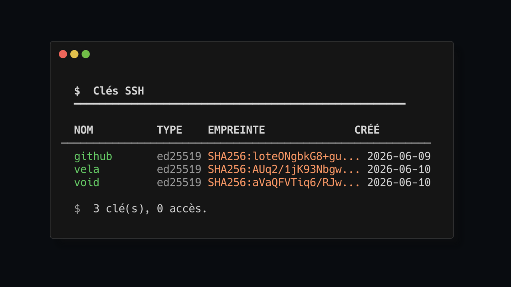

> [Lire en Francais](README.md) | [Read in English](README.en.md)

<div align="center">


# sshk

**SSH Key Manager — create, organize, grant, and revoke SSH keys. Pure Bash + OpenSSH.**

[](LICENSE)
[](https://github.com/Sofian-bll/sshk/releases)
[](https://www.gnu.org/software/bash/)

</div>

## What is this?

`sshk` brings order to your SSH keys with a predictable directory structure — one identity per purpose, one command per action. Manage outgoing identities and incoming access with the same tool. Zero dependencies beyond OpenSSH.



## Quick Start

```bash
curl -fsSL https://raw.githubusercontent.com/Sofian-bll/sshk/main/install.sh | bash
```

```bash
sshk create      # Interactive wizard to create a new SSH key
sshk list        # List all your identities
sshk show mykey  # Show public key and config snippet
sshk copy mykey  # Copy public key to clipboard
sshk grant mykey # Grant access to another machine
```

## Usage

| Command | Description |
|---------|-------------|
| `create` | Interactive wizard — new SSH key |
| `list` | List all managed identities |
| `show <name>` | Display public key + config |
| `copy <name>` | Copy public key to clipboard |
| `grant <name>` | Copy key to target host's authorized_keys |
| `revoke <name>` | Revoke access (local + remote) |
| `delete <name>` | Delete an identity |
| `help` | Show full help |

## Structure

```
~/.ssh/keys/           Identities (one per key)
~/.ssh/authorized_keys.d/   Incoming access (one file per source)
~/.ssh/config.d/            Auto-assembled SSH config
```

## License

MIT © 2026 Sofian — see [LICENSE](LICENSE).
